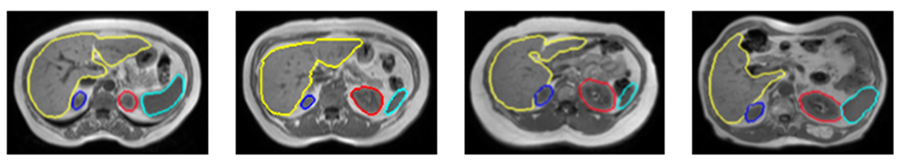

# Transformers for multi-organ segmentation in abdominal imaging

### Context:
The rapid development of non-invasive medical imaging technologies has opened new horizons in the study of
anatomy. The segmentation of 3D images by magnetic resonance imaging (MRI) has become a crucial step for many applications: computer-aided diagnosis, surgical planning, image-guided interventions, extraction of quantitative indices...
However, the analysis of complex and heterogeneous imaging data sets is tedious for radiologists, clinicians and
researchers. Moreover, the techniques developed to date are not fully robust to low contrast, anatomical variability and intrinsic noise in medical images. Although time consuming and subject to significant intra/inter-expert variability, segmentation of anatomical
structures is still largely performed manually, slice by slice.
Methodological developments allowing an automated and precise delimitation of structures of interest in
medical imaging are required, in particular for the segmentation of abdominal organs (liver, kidneys, spleen, pancreas...).

----
In this project, we implemented different models for medical image semantic segmentation using pytorch, this repository hosts the code for the following Networks :
1. Unet (Full convolutional neural network).
2. Segmenter (Full transformers).
3. Medical Transfomer & TransUnet(Hybrid architectures: CNN + Transformers). 

### Implementation:

####  1. Environment

Please prepare an environment with python, and then use the command "pip install -r requirements.txt" for the dependencies.

####  2. Dataset

Please follow the instructions in the [README.md](data/README.md) in the [/data](data) directory to be able to use the code in this github with your data correctly.

####  3. Pretrained models

If you want to use the transunet model where the encoder weights have already been trained on imagenet, please follow the instructions in the [README.md](segmentation_models/transunet/vit_checkpoint/README.md) in the [/segmentation_models/transunet/vit_checkpoint](segmentation_models/transunet/vit_checkpoint) directory.
If you want to use the transunet model where the encoder weights have already been trained on imagenet, please follow the instructions in the [README.md](segmentation_models/segmenter/README.md) in the [/segmentation_models/segmenter](segmentation_models/segmenter) directory.

####  4. Training

Run the train script on synapse dataset and choose the model to train with: python train.py --model_name xxxxx. Select one model among: 'Unet / TransUnet / MedicalTransformer / Segmenter'.

You can change different hyperparameters related to the learning of the model in the parser argument present in the file train.py

If you want to use the models with your weights already trained on Imagenet, call the training file by completing it with: --is_pretrained

If you want to use a normalized dataset, you must then know the mean (X) and std (Y) of your dataset. 
Then call the training file by completing it with: --apply_normalization --mean X --std Y

### Acknowledgement:
The work was supervised by Mr Pierre-Henri Conze and Mr Vincent Jaouen.

### Citations:

#### Medical Transformer
https://github.com/jeya-maria-jose/Medical-Transformer

https://arxiv.org/abs/2102.10662 

#### TransUNet
https://github.com/Beckschen/TransUNet

https://arxiv.org/abs/2102.04306

#### UNet
https://github.com/qubvel/segmentation_models.pytorch

https://arxiv.org/abs/1505.04597

